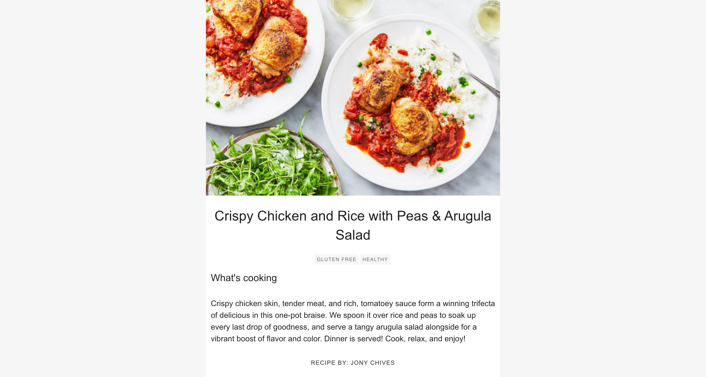

# Cookbook

Hi \*waves\* , this is my solution to the Marley Spoon Frontend Engineering Challenge.

## Running the app

### Option one - with Docker installed

- [Docker](https://www.docker.com/products/docker-desktop)

In terminal run the following command:

```sh
docker-compose up --build
```

This will run a production build of the app on [http://localhost:3000](http://localhost:3000)

### Option two - with Node and Yarn installed

- [Node 14](https://nodejs.org/en/)
- [Yarn](https://yarnpkg.com/getting-started/install)

In terminal run the following commands:

```sh
yarn
yarn start
```

This will run the app in development mode on [http://localhost:3000](http://localhost:3000)

## User Interface

Cookbook is a two page app.  
The first page is a list view of all the recipes. When you click on a recipe you're navigated to the second page which is a details view of a recipe.

The recipe pages have the recipe id in the url to support easy sharing of the recipes with other people.

### List view

- Display a preview of all recipes, including:
  - Title
  - Image


### Details view

- Display all the data for a recipe:

  - Title
  - Image
  - List of Tags
  - Description (with Markdown rendered)
  - Chef Name



## App architecture

This is a React with TypeScript project that was set up using [Create React App](https://create-react-app.dev/docs/adding-typescript/)

[Api.ts](src/Api.ts) is home to all the API calls made to the Content Delivery API

[Cookbook.tsx](src/components/Cookbook.tsx) and [Recipe.tsx](src/components/Recipe.tsx) are the two main components

[App.tsx](src/App.tsx) is the core component which handles routing between the two main components

[App.css](src/App.css) holds all the styling for the app

## Testing

### Unit tests

Run the following command to run the unit tests:

```
yarn test
```

Launches the test runner in the interactive watch mode.\
See the section about [running tests](https://facebook.github.io/create-react-app/docs/running-tests) for more information.

### Storybook

I used [Storybook](https://storybook.js.org/) to showcase the components in different states such as when an API call fails.

To launch Storybook run this command:

```
yarn storybook
```

## Areas to improve

- More unit tests!! - I have only written a few tests for the main app. Ideally I would add tests for every component.
- Find a better home for the Contentful API keys to avoid committing them to the repo and passing them to the client.
- Responsive design for different devices, screen sizes and browsers. I primarily built the app on my laptop, testing in Chrome and Firefox.
- Error reporting to monitor client side errors
- Split the css out into individual files for each component
